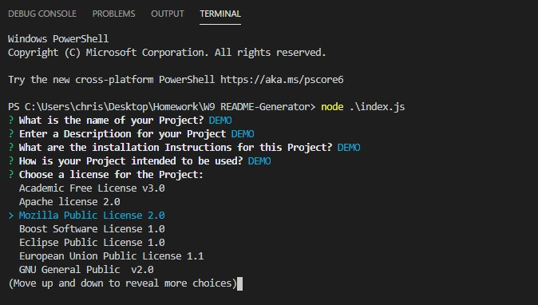
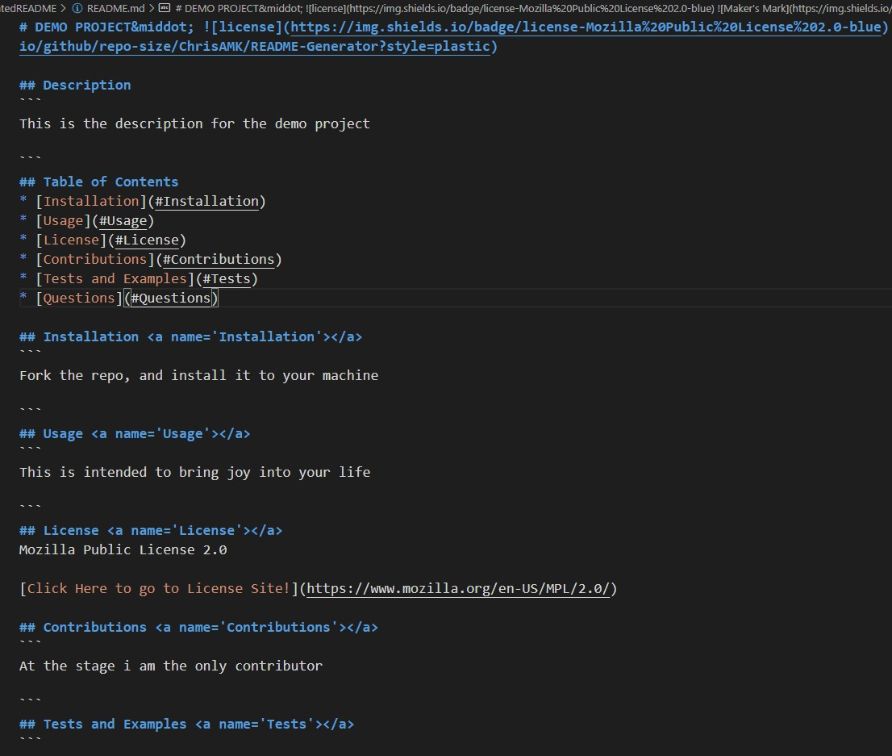

# 04 Web APIs: Code Quiz

Deployed URL : https://chrisamk.github.io/JavaScript-Quiz-Game/
Github Link : https://github.com/ChrisAMK/JavaScript-Quiz-Game

For this project we were tasked with Creating a README generator, it's primary function is to take in input from the user and display that information back in a professional manner that resembles a proper README file that you would see in someone's repository.

